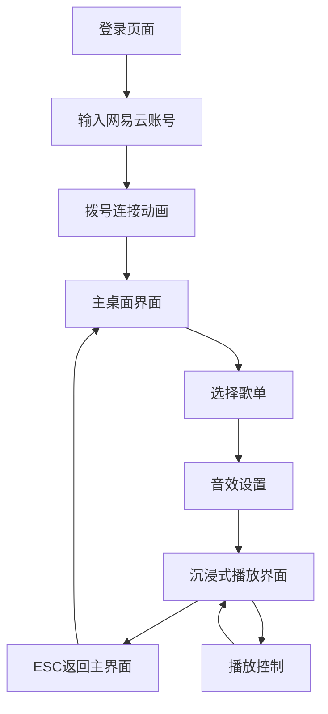

# 千禧复古风音乐播放器 - 产品需求文档

## 1. 产品概述

千禧复古风音乐播放器是一款基于Win95视觉风格的沉浸式音乐应用，专为冥想、自习和放松场景设计。产品将用户的网易云歌单实时转化为舒缓的lofi复古音乐，并在复古像素风界面中提供沉浸式播放体验。

目标用户为追求专注学习和放松体验的年轻用户群体，通过怀旧的视觉设计和现代音频处理技术，创造独特的音乐聆听体验。

## 2. 核心功能

### 2.1 用户角色

| 角色 | 注册方式 | 核心权限 |
|------|----------|----------|
| 普通用户 | 网易云账号登录 | 可登录、获取歌单、播放音乐、调整音效参数 |

### 2.2 功能模块

我们的千禧复古风音乐播放器包含以下主要页面：

1. **登录页面**：拨号上网风格界面、网易云账号登录、连接状态显示
2. **主桌面界面**：Win95桌面布局、音乐播放器窗口、装饰性图标
3. **沉浸式播放界面**：全屏可视化特效、音乐节奏响应、ESC返回功能

### 2.3 页面详情

| 页面名称 | 模块名称 | 功能描述 |
|----------|----------|----------|
| 登录页面 | 拨号连接界面 | 模拟Win95拨号上网界面，输入网易云账号密码，显示连接进度和状态 |
| 登录页面 | 用户认证 | 调用网易云API进行用户登录验证，获取用户基本信息和权限 |
| 主桌面界面 | 桌面布局 | 4:3比例Win95桌面，黑色背景填充，左上角装饰图标（网上邻居、我的电脑） |
| 主桌面界面 | 音乐播放器窗口 | 右下角Win95风格播放器，显示用户头像、昵称、歌单列表 |
| 主桌面界面 | 歌单管理 | 展示用户收藏歌单，每个歌单包含播放按钮和设置按钮 |
| 主桌面界面 | 音效设置 | 调整lofi转化参数：ASMR强度、人声衰减、高低频削减程度 |
| 沉浸式播放界面 | 可视化特效 | Canvas/WebGL渲染像素风粒子或几何图案，随音乐节奏实时变化 |
| 沉浸式播放界面 | 音频处理 | 实时应用lofi效果：削减高低频、添加混响、减弱人声、ASMR 3D效果 |
| 沉浸式播放界面 | 交互控制 | ESC键返回主界面，播放控制（暂停/继续/切歌） |

## 3. 核心流程

**用户操作流程：**

1. 用户访问应用，进入拨号上网风格的登录界面
2. 输入网易云账号密码，系统模拟拨号连接过程
3. 登录成功后进入Win95风格主桌面，显示用户信息和歌单列表
4. 用户选择歌单，点击播放按钮获取歌曲列表
5. 系统应用lofi音效处理，进入沉浸式播放界面
6. 播放界面展示随音乐变化的像素风特效
7. 用户可按ESC返回主界面，或调整音效参数

## 4. 用户界面设计

### 4.1 设计风格

- **主色调**：经典Win95灰色调（#C0C0C0）、蓝色标题栏（#0078D4）
- **辅助色**：黑色背景（#000000）、绿色连接指示（#00FF00）
- **按钮样式**：3D凸起效果，经典Win95按钮边框
- **字体**：MS Sans Serif字体，12px-14px主要文字
- **布局风格**：窗口化界面，4:3比例居中显示
- **图标风格**：16x16像素图标，经典Win95系统图标风格

### 4.2 页面设计概览

| 页面名称 | 模块名称 | UI元素 |
|----------|----------|--------|
| 登录页面 | 拨号连接界面 | 模拟调制解调器界面，进度条动画，连接状态文字，复古音效 |
| 主桌面界面 | 桌面布局 | 4:3灰色桌面区域，黑色边框填充，任务栏底部，开始按钮 |
| 主桌面界面 | 音乐播放器窗口 | Win95窗口框架，标题栏，最小化/关闭按钮，内容区域分栏布局 |
| 沉浸式播放界面 | 可视化特效 | 全屏黑色背景，彩色像素粒子，几何图案动画，音频频谱可视化 |

### 4.3 响应式设计

产品采用桌面优先设计，主要针对1024x768及以上分辨率。4:3比例的主界面居中显示，其余区域使用黑色填充。不考虑移动端适配，专注于桌面端的沉浸式体验。