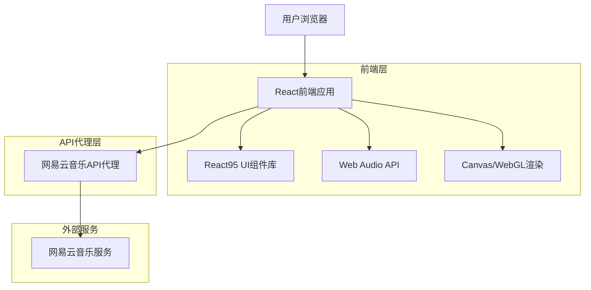
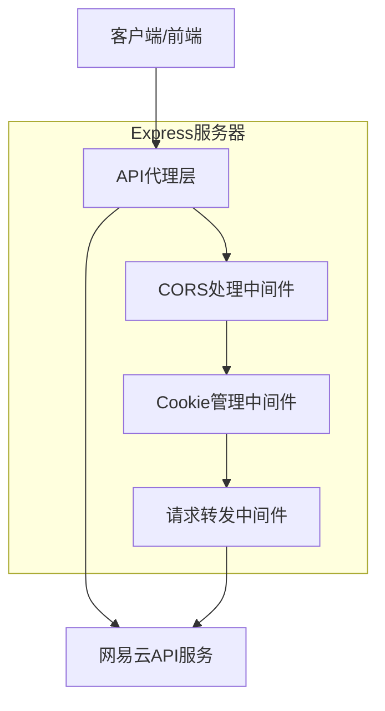
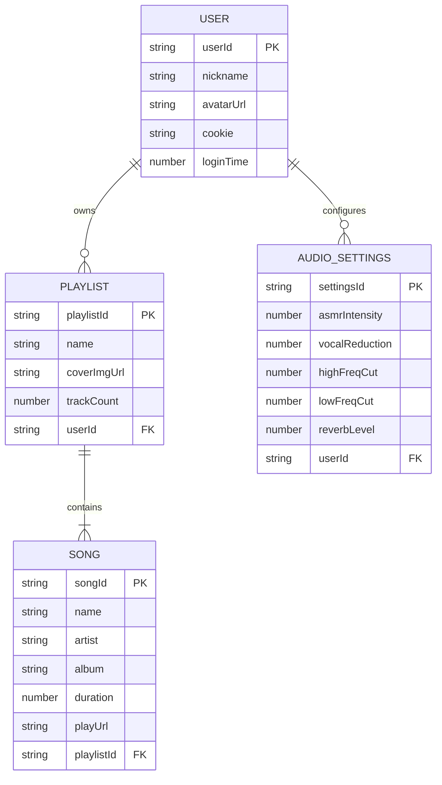

# 千禧复古风音乐播放器 - 技术架构文档

## 1. 架构设计



## 2. 技术描述

* 前端：React\@18 + <React95@3.x> + <styled-components@5.x> + <vite@4.x>

* 音频处理：Web Audio API + <Tone.js@14.x>

* 可视化：Canvas API + <Three.js@0.150.x>

* API代理：<Express@4.x> (解决CORS问题)

* 状态管理：React Context + useReducer

## 3. 路由定义

| 路由         | 用途                    |
| ---------- | --------------------- |
| /          | 登录页面，拨号上网风格的网易云账号登录界面 |
| /desktop   | 主桌面界面，Win95风格桌面和音乐播放器 |
| /immersive | 沉浸式播放界面，全屏可视化特效和音频播放  |

## 4. API定义

### 4.1 核心API

**用户认证相关**

```
POST /api/login
```

请求参数：

| 参数名      | 参数类型   | 是否必需 | 描述       |
| -------- | ------ | ---- | -------- |
| phone    | string | true | 网易云账号手机号 |
| password | string | true | 账号密码     |

响应参数：

| 参数名     | 参数类型   | 描述           |
| ------- | ------ | ------------ |
| code    | number | 响应状态码，200为成功 |
| cookie  | string | 登录凭证cookie   |
| profile | object | 用户基本信息       |

示例：

```json
{
  "phone": "13800138000",
  "password": "your_password"
}
```

**获取用户歌单**

```
GET /api/user/playlist
```

请求参数：

| 参数名    | 参数类型   | 是否必需 | 描述   |
| ------ | ------ | ---- | ---- |
| uid    | string | true | 用户ID |
| cookie | string | true | 登录凭证 |

响应参数：

| 参数名      | 参数类型   | 描述    |
| -------- | ------ | ----- |
| playlist | array  | 歌单列表  |
| code     | number | 响应状态码 |

**获取歌单详情**

```
GET /api/playlist/detail
```

请求参数：

| 参数名    | 参数类型   | 是否必需 | 描述   |
| ------ | ------ | ---- | ---- |
| id     | string | true | 歌单ID |
| cookie | string | true | 登录凭证 |

**获取歌曲播放地址**

```
GET /api/song/url
```

请求参数：

| 参数名 | 参数类型   | 是否必需  | 描述            |
| --- | ------ | ----- | ------------- |
| id  | string | true  | 歌曲ID          |
| br  | number | false | 音质等级，默认320000 |

## 5. 服务器架构图



## 6. 数据模型

### 6.1 数据模型定义



### 6.2 本地存储结构

**用户会话数据 (localStorage)**

```javascript
// 用户登录信息
const userSession = {
  userId: 'string',
  nickname: 'string',
  avatarUrl: 'string',
  cookie: 'string',
  loginTime: 'number',
  expiresAt: 'number'
};

// 音效设置
const audioSettings = {
  asmrIntensity: 0.5,      // ASMR强度 0-1
  vocalReduction: 0.7,     // 人声衰减 0-1
  highFreqCut: 8000,       // 高频截止频率 Hz
  lowFreqCut: 100,         // 低频截止频率 Hz
  reverbLevel: 0.3,        // 混响强度 0-1
  spatialEffect: true      // 3D空间效果开关
};

// 播放状态
const playbackState = {
  currentSong: 'object',
  currentPlaylist: 'object',
  isPlaying: 'boolean',
  currentTime: 'number',
  volume: 'number',
  isImmersiveMode: 'boolean'
};
```

**缓存数据结构 (sessionStorage)**

```javascript
// 歌单缓存
const playlistCache = {
  [playlistId]: {
    data: 'object',
    timestamp: 'number',
    expiresIn: 300000  // 5分钟缓存
  }
};

// 歌曲URL缓存
const songUrlCache = {
  [songId]: {
    url: 'string',
    timestamp: 'number',
    expiresIn: 1800000  // 30分钟缓存
  }
};
```

